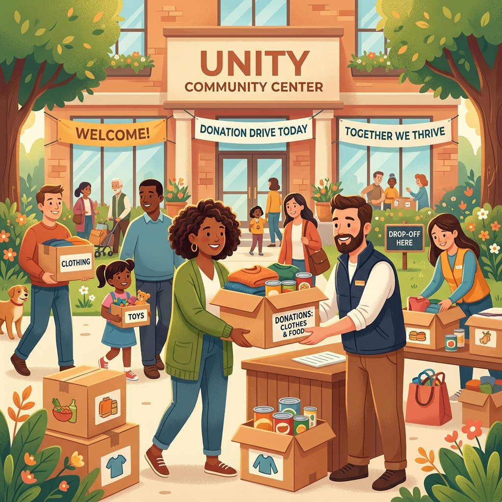

<!-- Banner Placeholder -->
<!-- <div align="center">
  
</div> -->

# Setu (सेतु) 
Meaning Bridge . 
The project proposes an intelligent solution to bridge the massive gap between people who want to donate unused goods and the Non-Governmental Organizations (NGOs) that desperately need them. Through Setu—a dual-sided platform powered by AI—users can **<u>effortlessly donate by simply taking a photo, while NGOs can dynamically manage their live inventory needs.</u>**

---

# How To Run

Here are the steps to run the Setu Flutter app locally on your machine or Android Studio:

1. Install Flutter and Android Studio (or VS Code).
2. Clone this repository to your local machine.
3. Open the project folder in your IDE.
4. Before running the application, you need API keys for Google Gemini and Google Maps:
    1. Issue your Gemini API Key from Google AI Studio.
    2. Issue your Google Maps API Key from the Google Cloud Console.
5. Create an `.env` file under your project root and insert your keys:
    ```
    GEMINI_API_KEY="Your_GEMINI_API_KEY"
    GOOGLE_MAPS_API_KEY="Your_Google_Maps_API_KEY"
    ```
6. Ensure you have an active Firebase project. Run `flutterfire configure` to link your Firebase project and generate `firebase_options.dart`.
7. Once your IDE loads the project, run `flutter pub get` to install dependencies.
8. Select an emulator or connect a mobile device and run the app!

<!-- ### **Test Accounts**
- **Donor Account**
    - ID : donor@test.com
    - PW : password123

- **NGO Account**
    - ID : ngo@test.com
    - PW : password123

-->

# Contents

1. [Overview](#Overview)
2. [Necessity - The Crisis of Waste](#Necessity)
3. [What Makes Setu Different](#Whats-Different-from-Before)
4. [UN SDGs](#UN_SDGs)
5. [Skills & Technologies](#Skills)
6. [Screens & Core Features](#Screens)
7. [Expected Effect](#Expected_Effect)
8. [Closing](#Closing)
   
---

<a name="Overview"></a>
# Overview

## **A Crisis of Usable Waste in India**

In India alone, millions of tons of perfectly usable goods end up as wastage every year. Despite rising environmental awareness, the core principles of the **"3 Rs" (Reduce, Reuse, Recycle)** are largely being ignored. 

People want to reuse and donate their old clothing, electronics, and books, but finding the right charity is an incredibly cumbersome process. On the other side, NGOs are often overwhelmed with random, unneeded items dropped at their doorsteps—ultimately resulting in massive secondary landfill waste because they lack the resources to sort and distribute them.

<a name="Necessity"></a>
# Necessity

We conducted research into why the "Reuse" aspect of the 3 Rs is failing in modern communities:

1. **Donor Friction:** Donors abandon the process because it requires researching local charities, figuring out what they accept, writing out item descriptions, and planning logistics.
2. **NGO Overstock:** Charities frequently receive items they have no use for. A shelter might need winter clothing but instead receives boxes of broken toys. This creates a severe storage and logistical nightmare for underfunded NGOs.
3. **Lack of Communication:** There is no centralized bridge to connect a willing donor directly with an NGO that needs that exact item at that exact time.

## Solution Proposal
To address these challenges, we built **Setu** (meaning "Bridge"). Setu is a demand-driven donation ecosystem that uses AI to remove all friction for the donor, while giving NGOs complete control over what they receive.

---

<a name="Whats-Different-from-Before"></a>
# What Makes Setu Different

### 🤖 "Snap-to-Match" AI Architecture
We completely eliminated manual data entry. Using a hybrid AI approach (Google ML Kit for edge detection + Gemini Vision API for deep analysis), donors simply take a photo of their item. The AI automatically identifies the object, assesses its condition, and categorizes it. 

### 🎛️ Dynamic NGO Control Panel
Unlike traditional platforms where NGOs passively receive whatever is given, Setu provides a live dashboard. NGOs can dynamically toggle switches (e.g., turning off "Clothing" if their warehouse is full, but keeping "Food" active). 

### 💬 Integrated Logistics & Chat
Setu isn't just a matching engine; it's a communication hub. With built-in formal Donation Requests and an in-app messaging (chat) system, donors and NGOs can securely coordinate drop-off times or pickup logistics without leaving the app.

---

<a name="UN_SDGs"></a>
# UN SDGs

Setu actively contributes to the United Nations Sustainable Development Goals:

<div style="display: flex; gap: 10px;">
  
  
</div>

* **Goal 11: Sustainable Cities and Communities** - Reducing urban waste and supporting local welfare organizations.
* **Goal 12: Responsible Consumption and Production** - Directly facilitating the "Reuse" phase of the lifecycle, preventing usable goods from reaching landfills.

---

<a name="Skills"></a>
# Skills & Technologies

|   Firebase   |    Flutter    |  Gemini 1.5 Pro API  | Google ML Kit | Google Maps |
|:------------:|:-------------:|:-------------:|:-------------:|:-------------:|
|   |  |  |  |  |

---

<a name="Screens"></a>
# Screens & Core Features

### 1. Dual-Persona Home Screens
- **For Donors:** A clean dashboard showing active campaigns, personal donation statistics, and a prominent "Scan to Give" action button.
- **For NGOs:** A comprehensive view of incoming donation requests, active chats, and weekly fulfillment metrics.

### 2. AI Scanner & Result
- A full-screen camera interface guides the user to take a clear photo.
- The **Gemini AI Result Screen** displays the extracted data: precise Item Name, Category Icon, and Condition Tag, automatically matched to a list of relevant NGOs via Google Maps.

### 3. The NGO Control Panel
- A settings-style list of toggle switches allowing an NGO to instantly activate or deactivate their needs for categories like Clothing, Books, Electronics, Toys, and Food.

### 4. Direct Messaging & Coordination
- A dedicated Messages Tab allows seamless, real-time chat between the donor and the charity to finalize logistics, ensuring successful drop-offs and preventing miscommunications.

---

<a name="Expected_Effect"></a>
# Expected Effect

- **Reviving the "Reuse" Culture**
  By removing the friction of donating, Setu makes reusing items easier than throwing them away, drastically reducing the millions of tons of waste sent to landfills annually.
- **Empowering NGOs**
  Charities regain control over their inventory. By only receiving what they explicitly request, NGOs save thousands of hours and dollars previously spent sorting and disposing of unwanted goods.
- **Building Stronger Communities**
  The direct messaging and location-based matching foster hyper-local connections, allowing neighbors to directly support the safety nets operating in their own backyards.

---

<a name="Closing"></a>
# Closing

*"One person's clutter is a community's lifeline."*

The massive wastage happening globally is not born out of malice, but out of inconvenience. People want to do the right thing, but the system is broken.

Setu serves as the digital bridge between excess and necessity. By combining state-of-the-art AI with a highly practical, demand-driven marketplace, we are ensuring that the **"Reuse"** in Reduce, Reuse, Recycle is finally accessible to everyone. 

We envision a future where donating a winter coat to someone who is cold is as simple as taking a photograph.
